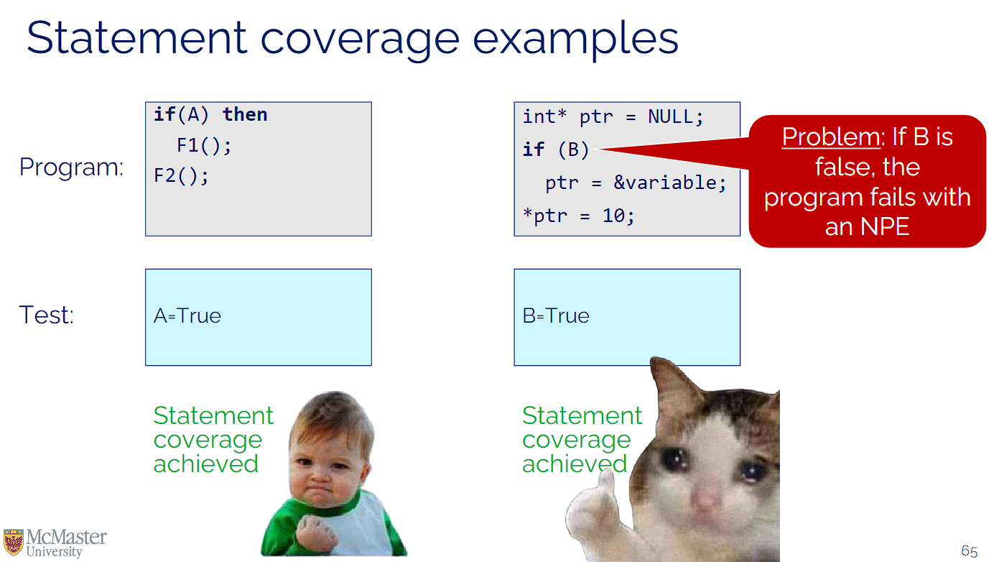
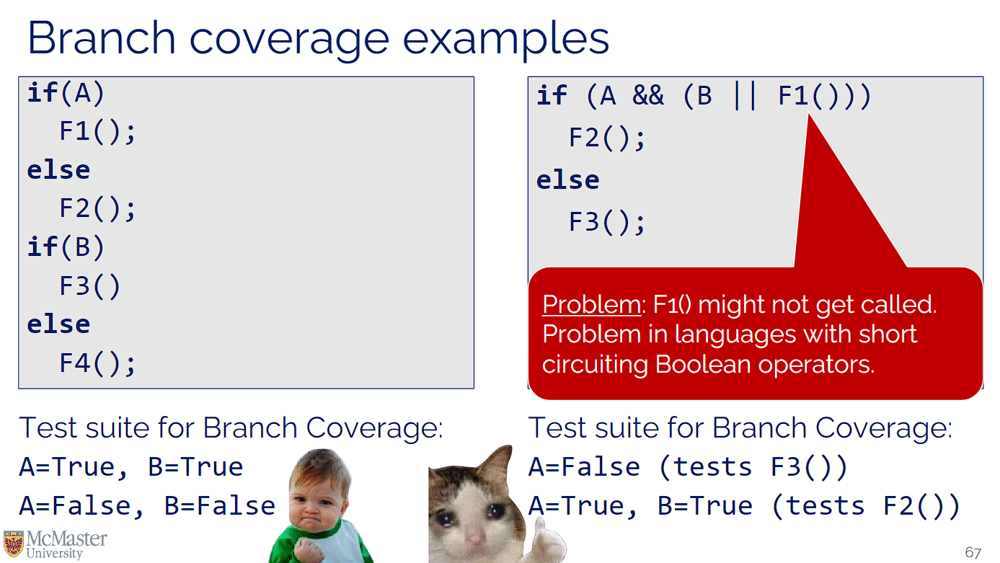
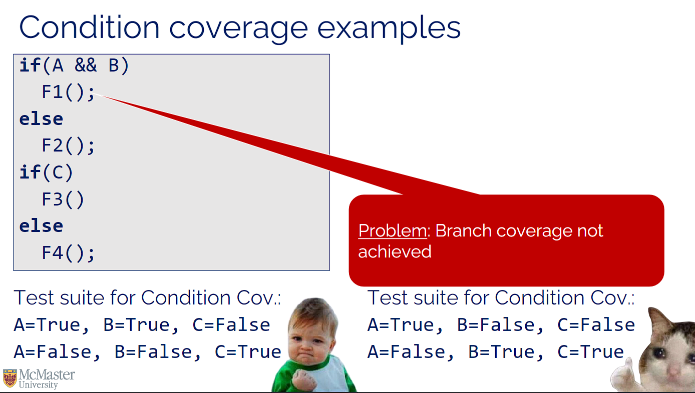
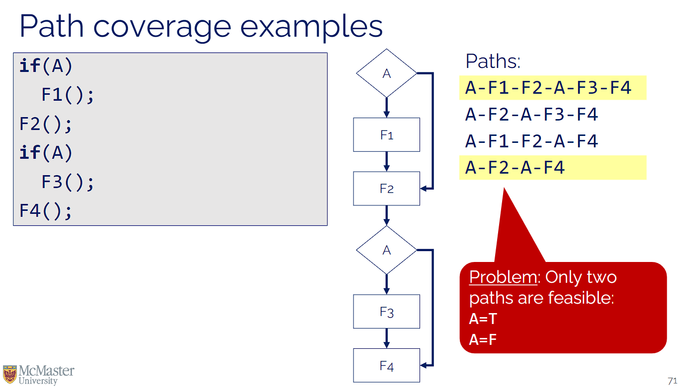

# Week 3 - Lecture 2

**Partition testing**: testing by partitioning the input domain (based on their significance for the program) and selecting input values from those partitions.

- ensures that each partition is adequately tested
- How to use:

    - Identify partitions: Group inputs that are expected to behave similarly (e.g., valid inputs, invalid inputs, boundary values)
    - Select test cases: Choose one or more representative values from each partition
    - Execute tests: Verify that the program behaves as expected for each partition

- it also educes the number of test cases while maintaining good coverage
- Example:

    - let us say that we have a function that accepts integers between 1 and 100
    - our partitions are [1, 50], [51, 100], and invalid inputs
    - test cases: 1, 50, 51, 100, 0, and 101

**Boundary testing**: testing by choosing inputs that are on semantically significant boundaries.

- catches errors that occur at the limits of input ranges
- an example is when a function that accepts integers between 1 and 100, test inputs like 1, 100, 0, and 101.

**Coverage-based testing**: testing until some measure of coverage reaches a pre-agreed target.

- helps ensure that a significant part of the code is exercised during testing

**Statement coverage**: white box testing technique that ensures that all the statements of the source code are executed at least once.

- does not guarantee that all branches or conditions are tested



```
def check_age(age):
    if age >= 18:       # Statement 1
        return "Adult"  # Statement 2
    else:
        return "Minor"  # Statement 3

age = 20                # covers statement 1 and 2
age = 15                # covers statement 3
```


**Branch coverage**: white box testing technique that ensures each branch (equivalently, each decision) is executed at least once during testing.



```
def check_temperature(temp):
    if temp > 30:      # Branch 1 (temp > 30)
        return "Hot"
    elif temp < 10:    # Branch 2 (temp < 10)
        return "Cold"
    else:              # Branch 3 (10 <= temp <= 30)
        return "Mild"

temp = 35              # covers branch 1
temp = 5               # covers branch 2
temp = 15              # covers branch 3
```

**Condition coverage**: white box testing technique that ensures each condition is executed to both True and False evaluations.



```
def login(username, password):
    if username == "admin" and password == "secret":  # Conditions: (A and B)
        return "Access granted"
    else:
        return "Access denied"

A = true, B = true      -> permission granted
A = true, B = false     -> permission denied
A = false, B = true     -> permission denied
A = false, B = false    -> permission denied
```

**Path coverage**: white box testing technique that ensures each linearly independent path in the control graph is executed.



```
def calculate_discount(member, coupon):
    discount = 0
    if member:        # Path 1: member=True
        discount += 10
    if coupon:        # Path 2: coupon=True
        discount += 5
    return discount

member = True, coupon = True        # 15
member = True, coupon = False       # 10
member = False, coupon = True       # 5
member = False, coupon = False      # 0

```
Path Coverage > MC/DC Coverage > Branch/Condition Coverage > Statement Coverage

**Fault injection**: testing by deliberately introducing faults into the software.

- helps identify how the system behaves under failure conditions
- helps improve fault tolerance and reliability
