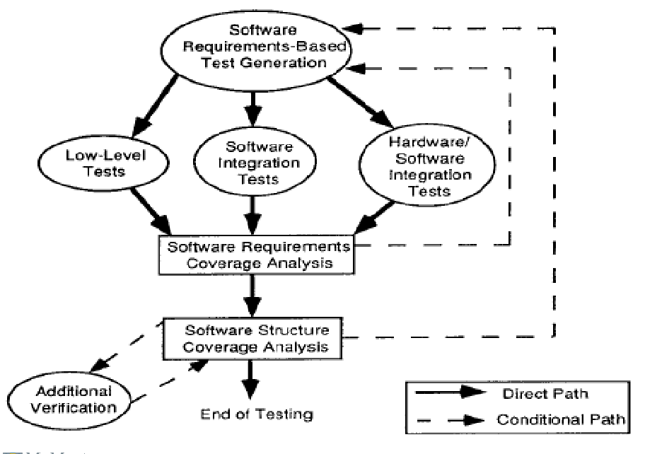

# Week 4 - Lecture 2 and 3

## Section 1: The goals of testing

Goals when testing:

- find max{0, bugs}
- find edge cases
- do the above with minimum cost and time

Industrial Perspective:

- demonstrate that software meets requirement
- demonstrate that the errors have been removed

Testing Overview:

- **Low-Level Tests**: ensures software components satisfy low-level and derived requirements
- **Software Integration Tests**: ensures software components interact correctly with each
other and satisfy software requirements and software architecture
